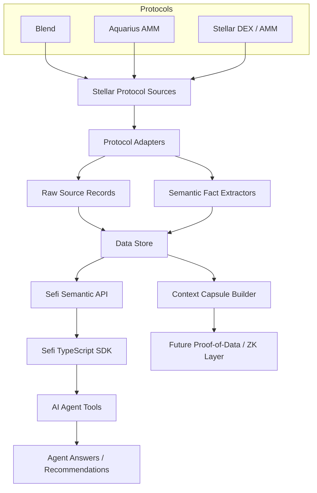
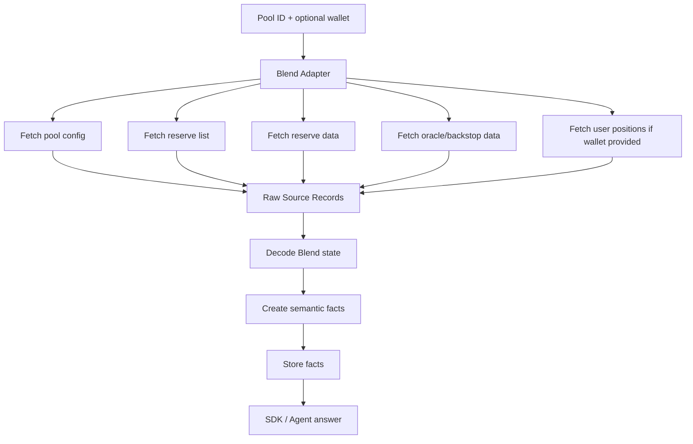
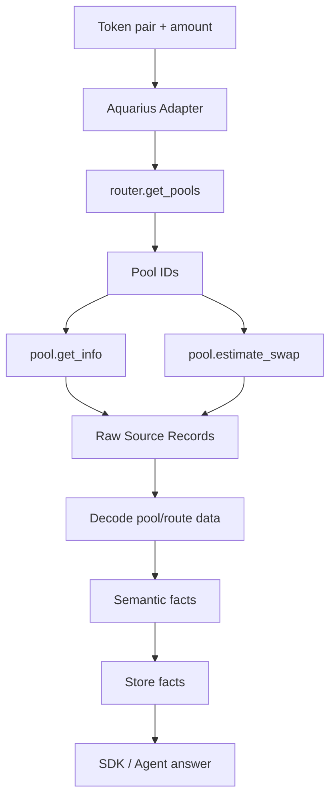
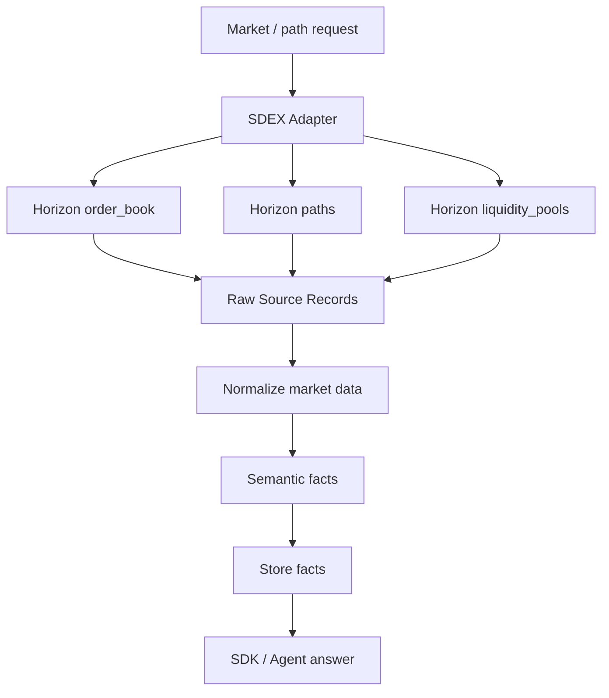
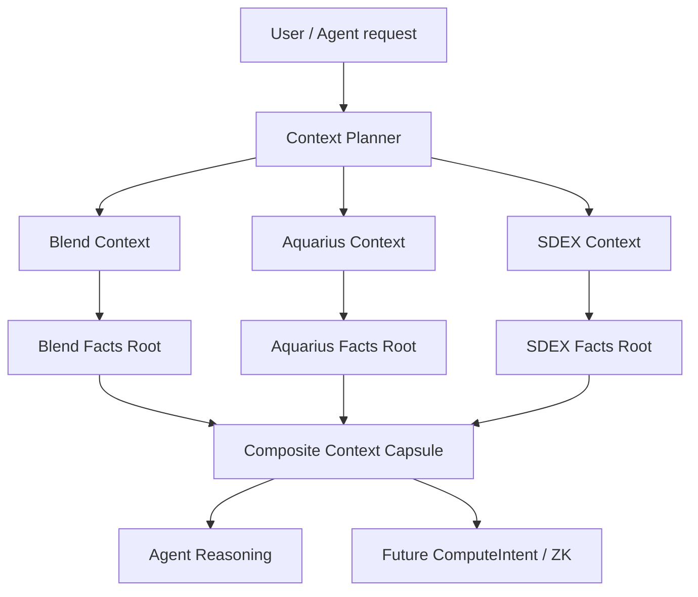
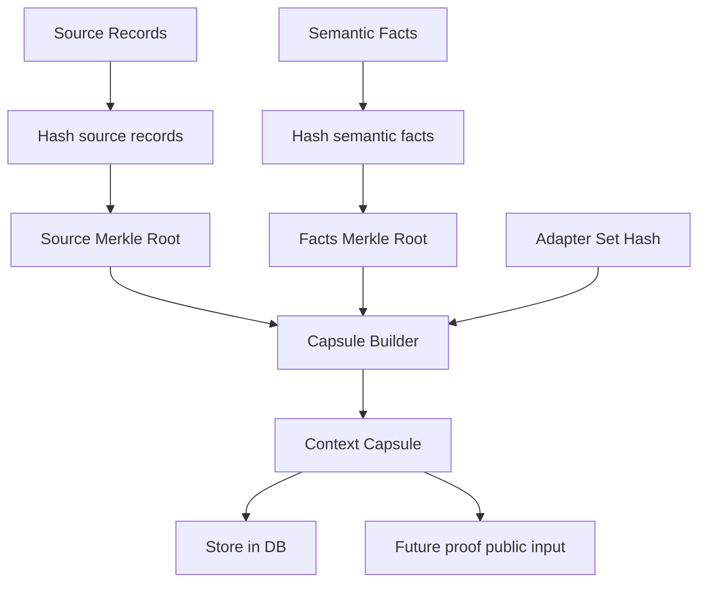
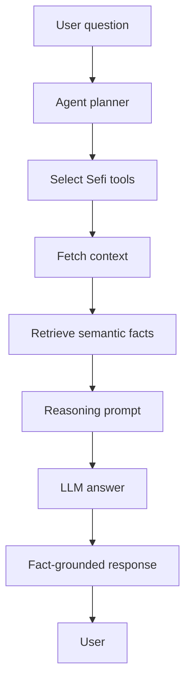
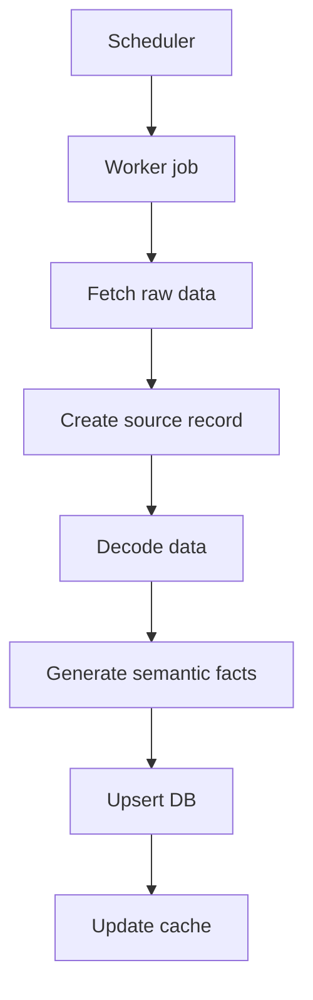
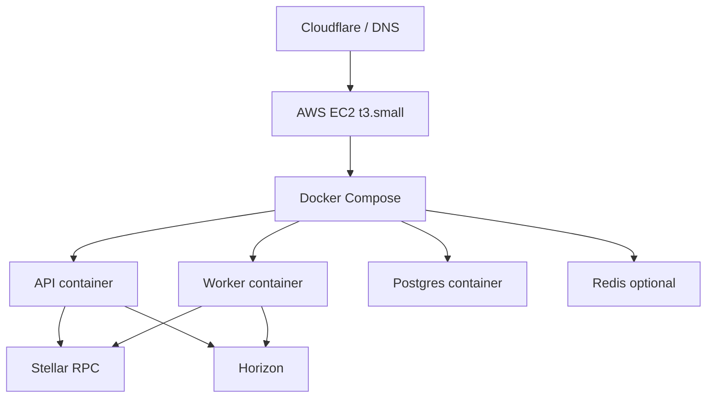

# Sefi Stellar Indexing + Agent SDK — Part 1 Agent Build Specification

**Version:** 1.0  
**Scope:** Protocol indexing, unified semantic layer, SDK design, and AI-agent answering layer for **Blend**, **Aquarius AMM**, and **Stellar DEX / Stellar AMM**.  
**Next phase:** Proof-of-data and ZK proof execution on Stellar.  
**Primary goal:** Give an AI coding agent enough context to implement Part 1 end-to-end without needing to re-derive the architecture.

---

## 0. Executive Summary

Sefi is being adapted from a Hedera-oriented blockchain semantic layer into a **Stellar Agent SDK**. The first phase does not focus on ZK proving yet. It focuses on building the foundation that makes ZK proving meaningful later:

1. **Index selected Stellar protocol surfaces**, not the whole chain.
2. **Normalize raw protocol data** from Blend, Aquarius, and Stellar DEX / Stellar AMM into a unified semantic ontology.
3. **Expose an SDK** that developers and AI agents can use to ask natural-language and programmatic questions.
4. **Attach raw source records** to every fact so the next phase can bind ZK proofs to the exact data used.
5. **Prepare multi-protocol context composition** so later ComputeIntents can prove claims like: “This Blend borrow is safe and there is enough Aquarius/SDEX exit liquidity.”

The system should be built as a protocol-scoped semantic layer, not as a full Stellar indexer. The main product idea is:

> Sefi lets AI agents understand Stellar protocols and answer questions from trusted, protocol-specific semantic context.

Later, this becomes:

> Sefi lets agents prove custom off-chain computations over that semantic context using proof-of-data capsules and ZK proofs.

---

## 1. Design Principles

### 1.1 Do not index the whole Stellar chain

Sefi should not attempt to mirror all Stellar activity. Instead, Sefi indexes protocol surfaces:

- **Blend**: lending pools, reserves, positions, oracle/backstop state, user estimates.
- **Aquarius AMM**: Soroban AMM pools, pool info, swap estimates, LP actions, rewards.
- **Stellar DEX / Stellar AMM**: Classic offers, order books, paths, trades, liquidity pools.

This keeps infrastructure small enough for a hackathon and fits the $100/month AWS constraint.

### 1.2 Raw data is not enough

Agents do not need raw XDR or raw Horizon JSON. They need protocol meaning:

- Is this action a borrow, repay, swap, or LP withdraw?
- Does this pool have enough liquidity?
- Is this reserve utilization high?
- Is this price/oracle status fresh?
- Does this action increase or reduce risk?

Sefi converts raw data into **semantic facts**.

### 1.3 Every semantic fact must be source-backed

Even before ZK, Sefi must record:

- Source endpoint or contract call.
- Ledger sequence / response ledger.
- Raw XDR or raw JSON response hash.
- Adapter version hash.
- Decoded semantic facts.

This creates the **proof-of-data handoff** for the next phase.

### 1.4 Agents should consume tools, not databases

The SDK should expose agent tools like:

```ts
sefi.blend.ask(...)
sefi.aquarius.ask(...)
sefi.sdex.ask(...)
sefi.context.compose(...)
sefi.facts.query(...)
```

The agent should not directly query PostgreSQL or parse RPC data.

### 1.5 Multi-protocol context is the product wedge

Single-protocol queries are useful, but the real innovation is multi-protocol reasoning:

- Blend safety + Aquarius exit liquidity.
- Blend borrow action + Stellar DEX market depth.
- Aquarius route + Classic AMM fallback.
- LP rewards + DEX liquidity + lending risk.

The architecture must support composite contexts from day one.

---

## 2. System Overview

### 2.1 High-level architecture



### 2.2 Core modules

| Module | Responsibility | Phase |
|---|---|---|
| `protocol-adapters/blend` | Fetch and decode Blend pool/reserve/user data | Phase 1 |
| `protocol-adapters/aquarius` | Fetch and decode Aquarius AMM pool/swap data | Phase 2 |
| `protocol-adapters/sdex` | Fetch Horizon/RPC DEX, AMM, path, offer data | Phase 3 |
| `semantic-core` | Unified ontology, fact model, normalization rules | Phase 1 |
| `source-records` | Raw response records and hashes | Phase 1 |
| `indexer-workers` | Scheduled/on-demand ingestion | Phase 1-3 |
| `api-server` | REST/RPC API for facts, context, questions | Phase 1 |
| `sdk-ts` | TypeScript SDK for developers and agents | Phase 1-3 |
| `agent-tools` | LangChain/OpenAI tool wrappers | Phase 2-4 |
| `context-capsules` | Bundles semantic facts + raw sources for future proofs | Phase 2-4 |
| `proof-handoff` | Interface for future proof-of-data/ZK layer | Phase 4 |

---

## 3. Repository Adaptation Plan

The original Sefi implementation is Hedera-oriented. The migration should preserve the core idea — a semantic layer for agents — while replacing Hedera-specific ingestion with Stellar protocol adapters.

### 3.1 Target monorepo structure

```txt
sefi/
  apps/
    api/                         # FastAPI/Node API server
    worker/                      # indexing workers
    demo-agent/                  # sample AI agent app
    dashboard/                   # optional frontend explorer

  packages/
    sdk-ts/                      # public TypeScript SDK
    agent-tools/                 # OpenAI/LangChain tools
    semantic-core/               # ontology, facts, normalization
    source-records/              # source hashing, raw records
    context-capsules/            # composite context builder
    protocol-blend/              # Blend adapter
    protocol-aquarius/           # Aquarius adapter
    protocol-sdex/               # Stellar DEX / AMM adapter
    shared-types/                # shared TS types

  services/
    postgres/                    # migrations, schema docs
    redis/                       # optional cache/job queue

  docs/
    architecture.md
    sdk.md
    adapters/
      blend.md
      aquarius.md
      sdex.md
    proof-of-data-handoff.md

  scripts/
    ingest-blend.ts
    ingest-aquarius.ts
    ingest-sdex.ts
    smoke-test.ts

  docker-compose.yml
  .env.example
```

### 3.2 Migration mapping from Hedera Sefi to Stellar Sefi

| Existing Sefi concept | Stellar replacement |
|---|---|
| Network client | Stellar RPC client + Horizon client |
| Contract/event ingestion | Soroban `getEvents`, `simulateTransaction`, Horizon endpoints |
| Token/account semantics | Stellar Asset, Trustline, Account, LiquidityPool |
| Protocol adapter | Blend/Aquarius/SDEX adapters |
| Agent semantic response | Protocol-scoped natural-language answers |
| Data confidence | SourceRecord + ledger sequence + response hash |
| Future proof binding | ContextCapsuleRoot / SourceRoot |

### 3.3 Agent instruction for repo work

When implementing, the agent should not start by adding ZK. First implement:

1. Data fetch.
2. Source record capture.
3. Semantic conversion.
4. SDK API.
5. Agent Q&A.

The proof layer depends on the source records and semantic facts being stable.

---

## 4. Data Sources and Indexing Strategy

### 4.1 Stellar data APIs used

Sefi should use three data access paths:

#### A. Stellar RPC

Used for Soroban contract state, simulation, and events.

Important methods:

- `simulateTransaction`: call read-only Soroban getter functions and capture result XDR.
- `getEvents`: fetch protocol-specific contract events.
- `getLedgerEntries`: fetch raw ledger entries when keys are known.

#### B. Horizon

Used for Classic Stellar DEX and AMM data.

Important endpoints:

- `/offers`
- `/order_book`
- `/trades`
- `/paths/strict-send`
- `/paths/strict-receive`
- `/liquidity_pools`
- `/liquidity_pools/:id`

#### C. Protocol SDKs / APIs

Used for developer convenience, metadata, and decoding.

- Blend SDK for pool/reserve/user-position helpers.
- Aquarius smart contract calls and optional backend API.

### 4.2 Indexing mode

Sefi should support two modes:

#### On-demand mode

Fetch current data only when an agent asks a question.

Best for hackathon MVP.

```txt
Agent asks question
  ↓
SDK requests context
  ↓
Adapter fetches current protocol data
  ↓
Facts are generated
  ↓
Answer is produced
```

#### Background ingestion mode

Periodically fetch key pools and markets.

Best for production and faster agent answers.

```txt
Scheduled worker
  ↓
Fetch selected protocol surfaces
  ↓
Store raw source records
  ↓
Update semantic facts
  ↓
Cache common summaries
```

### 4.3 Recommended MVP indexing frequency

| Surface | Frequency | Why |
|---|---:|---|
| Blend top pools | every 60 seconds | lending risk changes with pool state |
| Blend user positions | on demand | user-specific and privacy-sensitive |
| Aquarius top pools | every 60 seconds | swap/liquidity changes frequently |
| Aquarius swap estimates | on demand | amount/route-specific |
| SDEX order books | every 30-60 seconds | market data changes frequently |
| SDEX paths | on demand | amount and asset-specific |
| Classic liquidity pools | every 60 seconds | useful for fallback liquidity |

### 4.4 Storage model

Use PostgreSQL as the canonical store.

Redis can be added for caching, but should not be required for MVP.

---

## 5. Source Records

Source records are critical because the next phase will use them for proof-of-data.

### 5.1 SourceRecord interface

```ts
export type SourceKind =
  | "stellar_rpc_simulate"
  | "stellar_rpc_events"
  | "stellar_rpc_ledger_entries"
  | "horizon_orderbook"
  | "horizon_offers"
  | "horizon_trades"
  | "horizon_paths"
  | "horizon_liquidity_pools"
  | "protocol_api";

export interface SourceRecord {
  id: string;
  network: "testnet" | "mainnet";
  protocol: "blend" | "aquarius" | "stellar_dex" | "stellar_amm";
  sourceKind: SourceKind;
  endpoint?: string;
  contractId?: string;
  functionName?: string;
  argsXdr?: string;
  requestBodyHash: string;
  responseHash: string;
  rawResponseRef: string;
  ledgerSeq?: number;
  latestLedger?: number;
  fetchedAt: string;
  adapterName: string;
  adapterVersion: string;
  adapterHash: string;
}
```

### 5.2 Hashing rule

All raw responses must be canonicalized before hashing.

Recommended rule:

```txt
canonical_response = stable_json_stringify(response)
response_hash = sha256(canonical_response)
```

For XDR values:

```txt
xdr_hash = sha256(base64_xdr_string)
```

For source roots:

```txt
source_root = merkle_root(sorted(source_record_hashes))
```

### 5.3 Why this matters

A semantic fact should always be traceable:

```txt
semantic fact → source record → raw response hash → ledger sequence / endpoint
```

This allows:

- Auditing.
- Replay scripts.
- Multi-RPC comparison.
- Future proof-of-data capsules.
- Future ZK public inputs.

---

## 6. Unified Semantic Ontology

The ontology is the heart of Sefi. Every adapter should map raw protocol data into the same semantic vocabulary.

### 6.1 Universal entities

```txt
Asset
Account
Protocol
Pool
Reserve
Market
Position
Route
Offer
Trade
LiquidityPool
Oracle
Backstop
Reward
Action
RiskMetric
Constraint
SourceRecord
ContextCapsule
```

### 6.2 Universal actions

```txt
SUPPLY
WITHDRAW
BORROW
REPAY
SWAP
ROUTE
LP_DEPOSIT
LP_WITHDRAW
CLAIM_REWARD
PLACE_OFFER
CANCEL_OFFER
PATH_PAYMENT
```

### 6.3 Universal risk metrics

```txt
pool.utilization
borrow.limit
borrow.used
health.factor
oracle.freshness
liquidity.depth
liquidity.available
slippage.estimated
market.spread_bps
route.hops
reward.claimable
position.exposure
asset.approved
```

### 6.4 SemanticFact interface

```ts
export interface SemanticFact<T = unknown> {
  id: string;
  network: "testnet" | "mainnet";
  protocol: "blend" | "aquarius" | "stellar_dex" | "stellar_amm";
  entityType:
    | "asset"
    | "pool"
    | "reserve"
    | "market"
    | "position"
    | "route"
    | "oracle"
    | "backstop"
    | "reward";
  entityId: string;
  field: string;
  value: T;
  unit?: string;
  ledgerSeq?: number;
  sourceRecordIds: string[];
  rawHash: string;
  adapterHash: string;
  confidence: "high" | "medium" | "low";
  createdAt: string;
}
```

### 6.5 Fact examples

#### Blend utilization fact

```json
{
  "id": "fact_blend_usdc_utilization_123",
  "network": "mainnet",
  "protocol": "blend",
  "entityType": "reserve",
  "entityId": "blend_pool:C...:USDC",
  "field": "pool.utilization",
  "value": "0.73",
  "unit": "ratio",
  "ledgerSeq": 123456,
  "sourceRecordIds": ["src_blend_get_reserve_usdc"],
  "rawHash": "0x...",
  "adapterHash": "0x...",
  "confidence": "high",
  "createdAt": "2026-06-26T12:00:00+05:30"
}
```

#### Aquarius swap estimate fact

```json
{
  "id": "fact_aqua_estimated_out_123",
  "network": "mainnet",
  "protocol": "aquarius",
  "entityType": "route",
  "entityId": "aqua_route:USDC:XLM:100000000",
  "field": "slippage.estimated_out",
  "value": "98750000",
  "unit": "stroops",
  "ledgerSeq": 123457,
  "sourceRecordIds": ["src_aqua_estimate_swap"],
  "rawHash": "0x...",
  "adapterHash": "0x...",
  "confidence": "high",
  "createdAt": "2026-06-26T12:00:01+05:30"
}
```

#### Stellar DEX spread fact

```json
{
  "id": "fact_sdex_spread_xlm_usdc",
  "network": "mainnet",
  "protocol": "stellar_dex",
  "entityType": "market",
  "entityId": "market:XLM:USDC",
  "field": "market.spread_bps",
  "value": 21,
  "unit": "bps",
  "ledgerSeq": 123458,
  "sourceRecordIds": ["src_horizon_orderbook_xlm_usdc"],
  "rawHash": "0x...",
  "adapterHash": "0x...",
  "confidence": "medium",
  "createdAt": "2026-06-26T12:00:02+05:30"
}
```

---

## 7. Database Schema

### 7.1 Core tables

```sql
CREATE TABLE protocols (
  id TEXT PRIMARY KEY,
  name TEXT NOT NULL,
  network TEXT NOT NULL,
  type TEXT NOT NULL,
  metadata JSONB DEFAULT '{}',
  created_at TIMESTAMPTZ DEFAULT now()
);

CREATE TABLE protocol_entities (
  id TEXT PRIMARY KEY,
  protocol_id TEXT REFERENCES protocols(id),
  entity_type TEXT NOT NULL,
  entity_key TEXT NOT NULL,
  display_name TEXT,
  metadata JSONB DEFAULT '{}',
  created_at TIMESTAMPTZ DEFAULT now(),
  updated_at TIMESTAMPTZ DEFAULT now()
);

CREATE TABLE source_records (
  id TEXT PRIMARY KEY,
  network TEXT NOT NULL,
  protocol TEXT NOT NULL,
  source_kind TEXT NOT NULL,
  endpoint TEXT,
  contract_id TEXT,
  function_name TEXT,
  args_xdr TEXT,
  request_hash TEXT NOT NULL,
  response_hash TEXT NOT NULL,
  raw_response JSONB,
  raw_xdr TEXT,
  ledger_seq BIGINT,
  latest_ledger BIGINT,
  fetched_at TIMESTAMPTZ NOT NULL,
  adapter_name TEXT NOT NULL,
  adapter_version TEXT NOT NULL,
  adapter_hash TEXT NOT NULL
);

CREATE TABLE semantic_facts (
  id TEXT PRIMARY KEY,
  network TEXT NOT NULL,
  protocol TEXT NOT NULL,
  entity_type TEXT NOT NULL,
  entity_id TEXT NOT NULL,
  field TEXT NOT NULL,
  value JSONB NOT NULL,
  unit TEXT,
  ledger_seq BIGINT,
  raw_hash TEXT NOT NULL,
  adapter_hash TEXT NOT NULL,
  confidence TEXT NOT NULL,
  created_at TIMESTAMPTZ DEFAULT now()
);

CREATE TABLE fact_sources (
  fact_id TEXT REFERENCES semantic_facts(id) ON DELETE CASCADE,
  source_record_id TEXT REFERENCES source_records(id) ON DELETE CASCADE,
  PRIMARY KEY (fact_id, source_record_id)
);
```

### 7.2 Context capsule tables

```sql
CREATE TABLE context_capsules (
  id TEXT PRIMARY KEY,
  capsule_type TEXT NOT NULL,
  network TEXT NOT NULL,
  protocols TEXT[] NOT NULL,
  source_root TEXT NOT NULL,
  facts_root TEXT NOT NULL,
  composite_root TEXT NOT NULL,
  metadata JSONB DEFAULT '{}',
  created_at TIMESTAMPTZ DEFAULT now()
);

CREATE TABLE capsule_facts (
  capsule_id TEXT REFERENCES context_capsules(id) ON DELETE CASCADE,
  fact_id TEXT REFERENCES semantic_facts(id) ON DELETE CASCADE,
  PRIMARY KEY (capsule_id, fact_id)
);

CREATE TABLE capsule_sources (
  capsule_id TEXT REFERENCES context_capsules(id) ON DELETE CASCADE,
  source_record_id TEXT REFERENCES source_records(id) ON DELETE CASCADE,
  PRIMARY KEY (capsule_id, source_record_id)
);
```

### 7.3 Query indexes

```sql
CREATE INDEX idx_facts_protocol_entity ON semantic_facts(protocol, entity_type, entity_id);
CREATE INDEX idx_facts_field ON semantic_facts(field);
CREATE INDEX idx_facts_created_at ON semantic_facts(created_at DESC);
CREATE INDEX idx_sources_protocol_kind ON source_records(protocol, source_kind);
CREATE INDEX idx_sources_ledger ON source_records(ledger_seq DESC);
```

---

## 8. Blend Adapter

### 8.1 Role

The Blend adapter turns Blend lending data into lending semantics.

It must answer:

- What pools exist?
- What reserves are supported?
- What are supplied/borrowed amounts?
- What are collateral and liability factors?
- What is pool utilization?
- What is user position state?
- Is an action risk-increasing or risk-reducing?

### 8.2 Raw data sources

Use the Blend SDK where practical. Also capture raw outputs from the underlying RPC/simulation layer.

Key getter concepts:

```txt
get_config()
get_reserve_list()
get_reserve(asset)
get_positions(address)
get_reserve_emissions(reserve_token_id)
get_user_emissions(user, reserve_token_id)
```

### 8.3 Blend adapter flow



### 8.4 Blend semantic fields

```ts
export interface BlendPoolFacts {
  protocol: "blend";
  poolId: string;
  poolName?: string;
  poolStatus: "active" | "on_ice" | "unknown";
  reserves: BlendReserveFacts[];
  oracle?: {
    contractId: string;
    status: "fresh" | "stale" | "unknown";
    lastUpdatedLedger?: number;
  };
  backstop?: {
    status: "healthy" | "weak" | "unknown";
  };
}

export interface BlendReserveFacts {
  asset: string;
  totalSupplied: string;
  totalBorrowed: string;
  utilization: string;
  collateralFactor?: string;
  liabilityFactor?: string;
  supplyCap?: string;
  utilizationCap?: string;
  borrowApr?: string;
  supplyApr?: string;
}
```

### 8.5 Blend computations

#### Pool utilization

```txt
utilization = totalBorrowed / totalSupplied
```

#### Borrow safety

For a user position:

```txt
collateral_value_adjusted = sum(collateral_value_i * collateral_factor_i)
liability_value_adjusted = sum(liability_value_i / liability_factor_i)
borrow_capacity_remaining = collateral_value_adjusted - liability_value_adjusted
```

#### Risk direction

```txt
SUPPLY collateral → usually risk-reducing
REPAY debt → risk-reducing
BORROW more → risk-increasing
WITHDRAW collateral → risk-increasing
```

### 8.6 Blend SDK API

```ts
const blend = sefi.blend({ network: "testnet" });

const pool = await blend.getPoolContext({
  poolId: "C...",
  include: ["config", "reserves", "oracle", "backstop"]
});

const user = await blend.getUserContext({
  poolId: "C...",
  wallet: "G...",
  include: ["positions", "emissions"]
});

const answer = await blend.ask(
  "Is this user safe to borrow 100 USDC?",
  { poolId: "C...", wallet: "G..." }
);
```

### 8.7 Blend agent answer examples

#### Question

> Is this Blend pool risky right now?

#### Agent should answer from facts

```txt
The pool is moderately risky because USDC utilization is 84%, which is above the configured safe threshold of 80%. The oracle status is fresh, so the risk is primarily utilization-driven, not oracle-driven. A safer action would be to avoid new borrowing or add collateral.
```

#### Required source facts

- `pool.utilization`
- `oracle.freshness`
- `reserve.totalBorrowed`
- `reserve.totalSupplied`
- `reserve.utilizationCap`

---

## 9. Aquarius Adapter

### 9.1 Role

The Aquarius adapter turns Soroban AMM state into liquidity, route, swap, and LP semantics.

It must answer:

- What pools exist for these assets?
- Is this pool stable or volatile?
- What output can a swap estimate provide?
- What is the slippage?
- How many pools are in the route?
- Is this route acceptable under user constraints?

### 9.2 Raw data sources

Use Soroban smart contract methods primarily:

```txt
router.get_pools(tokens)
pool.get_info()
pool.estimate_swap(in_idx, out_idx, amount_in)
pool.deposit(...)
pool.withdraw(...)
pool.claim(...)
router.swap_chained(...)
```

Capture simulation outputs for read-only methods.

### 9.3 Aquarius adapter flow



### 9.4 Aquarius semantic fields

```ts
export interface AquariusPoolFacts {
  protocol: "aquarius";
  poolId: string;
  poolType: "constant_product" | "stable_swap" | "unknown";
  tokens: string[];
  feeBps?: number;
  totalShares?: string;
  tvl?: string;
  rewardZone?: boolean;
}

export interface AquariusSwapEstimateFacts {
  tokenIn: string;
  tokenOut: string;
  amountIn: string;
  estimatedOut: string;
  priceImpactBps?: number;
  slippageBps?: number;
  routeHops: number;
  poolIds: string[];
}
```

### 9.5 Aquarius computations

#### Minimum output check

```txt
route_acceptable = estimatedOut >= private.minOut
```

#### Slippage check

```txt
slippage_ok = slippageBps <= private.maxSlippageBps
```

#### Route length check

```txt
route_hops_ok = routeHops <= 4
```

### 9.6 Aquarius SDK API

```ts
const aqua = sefi.aquarius({ network: "testnet" });

const pools = await aqua.getPools({
  tokenA: "USDC",
  tokenB: "XLM"
});

const estimate = await aqua.estimateSwap({
  tokenIn: "USDC",
  tokenOut: "XLM",
  amountIn: "100000000"
});

const answer = await aqua.ask(
  "Can I swap 100 USDC to XLM with less than 1% slippage?",
  { tokenIn: "USDC", tokenOut: "XLM", amountIn: "100000000" }
);
```

### 9.7 Aquarius agent answer example

#### Question

> Is Aquarius a good exit route for my Blend position?

#### Agent answer

```txt
Aquarius has an available route from USDC to XLM with estimated output of 98.9 XLM for 100 USDC. Estimated slippage is under 1%, and the route uses two pools. This route is acceptable under the current policy.
```

#### Required source facts

- `route.estimated_out`
- `route.slippage_bps`
- `route.hops`
- `pool.type`
- `pool.liquidity`

---

## 10. Stellar DEX / Stellar AMM Adapter

### 10.1 Role

The SDEX adapter handles Classic Stellar liquidity:

- Order books.
- Offers.
- Trades.
- Strict-send/strict-receive paths.
- Classic liquidity pools.

It is important because Stellar liquidity is not only Soroban-based.

### 10.2 Raw data sources

Use Horizon for convenience:

```txt
/order_book
/offers
/trades
/paths/strict-send
/paths/strict-receive
/liquidity_pools
/liquidity_pools/:id
```

Use Stellar RPC `getLedgerEntries` later for stronger raw state capture when ledger keys are known.

### 10.3 SDEX adapter flow



### 10.4 SDEX semantic fields

```ts
export interface StellarDexMarketFacts {
  protocol: "stellar_dex";
  base: string;
  counter: string;
  bestBid?: string;
  bestAsk?: string;
  spreadBps?: number;
  depthAt1Pct?: string;
  depthAt2Pct?: string;
  recentVolume?: string;
}

export interface StellarPathFacts {
  sourceAsset: string;
  destinationAsset: string;
  sourceAmount?: string;
  destinationAmount?: string;
  pathAvailable: boolean;
  estimatedOut?: string;
  pathAssets: string[];
}

export interface StellarAmmPoolFacts {
  poolId: string;
  assets: string[];
  reserves?: string[];
  totalShares?: string;
  recentTrades?: number;
}
```

### 10.5 SDEX computations

#### Spread

```txt
spread_bps = ((bestAsk - bestBid) / midpoint) * 10000
```

#### Exit liquidity

```txt
exit_liquidity_ok = depthWithinSlippage(amount, private.maxSlippageBps) == true
```

#### Path output

```txt
path_ok = estimatedOut >= private.minReceive
```

### 10.6 SDEX SDK API

```ts
const sdex = sefi.sdex({ network: "mainnet" });

const market = await sdex.getMarket({
  base: "XLM",
  counter: "USDC"
});

const path = await sdex.findPath({
  sourceAsset: "USDC",
  destinationAsset: "XLM",
  sourceAmount: "100000000"
});

const answer = await sdex.ask(
  "Is there enough liquidity to exit 100 USDC into XLM?",
  { sourceAsset: "USDC", destinationAsset: "XLM", amount: "100000000" }
);
```

---

## 11. Multi-Protocol Context Composition

### 11.1 Why this matters

The strongest Sefi feature is not answering isolated protocol questions. It is answering cross-protocol questions:

> Can my agent borrow from Blend and still exit through Aquarius or SDEX safely?

This requires a composite context.

### 11.2 Composite context flow



### 11.3 CompositeContext interface

```ts
export interface CompositeContext {
  id: string;
  network: "testnet" | "mainnet";
  protocols: Array<"blend" | "aquarius" | "stellar_dex" | "stellar_amm">;
  facts: SemanticFact[];
  sourceRecords: SourceRecord[];
  roots: {
    sourceRoot: string;
    factsRoot: string;
    compositeRoot: string;
  };
  createdAt: string;
}
```

### 11.4 Multi-protocol SDK example

```ts
const ctx = await sefi.context.compose({
  blend: {
    poolId: BLEND_POOL,
    wallet: USER,
    include: ["reserves", "positions", "oracle"]
  },
  aquarius: {
    route: {
      tokenIn: "USDC",
      tokenOut: "XLM",
      amountIn: "100000000"
    },
    include: ["estimate_swap", "pool_info"]
  },
  sdex: {
    market: {
      base: "XLM",
      counter: "USDC"
    },
    include: ["orderbook", "paths", "liquidity_pools"]
  }
});
```

### 11.5 Multi-protocol answer example

#### Question

> Can I borrow USDC from Blend and still exit safely if the market moves?

#### Sefi reasoning path

```txt
1. Check Blend health after borrow.
2. Check Blend oracle freshness.
3. Estimate Aquarius swap route.
4. Check SDEX fallback path.
5. Answer with confidence and source-backed facts.
```

#### Answer

```txt
The action is conditionally safe. The Blend position remains above the configured risk threshold after borrowing, and the pool oracle is fresh. Aquarius provides a USDC→XLM route with estimated slippage below 1%. Stellar DEX also has a fallback path, but the spread is wider, so Aquarius is the preferred exit route. The agent should execute only if the final transaction simulation still confirms these values.
```

---

## 12. Context Capsules

Context capsules are the bridge to the future proof layer.

### 12.1 Purpose

A context capsule packages:

- Raw source record IDs.
- Source root.
- Semantic fact IDs.
- Facts root.
- Adapter hashes.
- Composite root.

### 12.2 Capsule creation flow



### 12.3 ContextCapsule interface

```ts
export interface ContextCapsule {
  id: string;
  capsuleType: "single_protocol" | "multi_protocol";
  network: "testnet" | "mainnet";
  protocols: string[];
  sourceRecordIds: string[];
  semanticFactIds: string[];
  sourceRoot: string;
  factsRoot: string;
  adapterSetHash: string;
  compositeRoot: string;
  ledgerRange?: {
    minLedger?: number;
    maxLedger?: number;
  };
  createdAt: string;
}
```

### 12.4 Capsule usage now and later

#### Now

Used for:

- Agent answer traceability.
- Debugging.
- Replay.
- Source confidence.

#### Later

Used as public input to ZK proofs:

```txt
public input: compositeRoot
private input: thresholds, hidden policy, hidden strategy
proof: result was computed over this context
```

---

## 13. SDK Design

### 13.1 SDK package structure

```txt
packages/sdk-ts/src/
  index.ts
  client.ts
  blend.ts
  aquarius.ts
  sdex.ts
  context.ts
  facts.ts
  agent.ts
  types.ts
```

### 13.2 Main client

```ts
export class SefiClient {
  constructor(private config: SefiConfig) {}

  blend() {
    return new BlendModule(this.config);
  }

  aquarius() {
    return new AquariusModule(this.config);
  }

  sdex() {
    return new SdexModule(this.config);
  }

  context() {
    return new ContextModule(this.config);
  }

  agentTools() {
    return new AgentToolsModule(this.config);
  }
}
```

### 13.3 Developer usage

```ts
import { SefiClient } from "@sefi/sdk";

const sefi = new SefiClient({
  network: "testnet",
  apiKey: process.env.SEFI_API_KEY,
  apiUrl: "https://api.sefi.dev"
});

const answer = await sefi.blend().ask({
  question: "Is this pool safe to borrow from?",
  poolId: "C...",
  wallet: "G..."
});

console.log(answer.text);
console.log(answer.facts);
console.log(answer.contextCapsuleId);
```

### 13.4 Unified ask API

```ts
const answer = await sefi.ask({
  question: "Can I borrow from Blend and exit through Aquarius if needed?",
  context: {
    blend: { poolId, wallet },
    aquarius: { tokenIn: "USDC", tokenOut: "XLM", amountIn: "100000000" },
    sdex: { base: "XLM", counter: "USDC" }
  }
});
```

### 13.5 Response format

```ts
export interface SefiAnswer {
  text: string;
  confidence: "high" | "medium" | "low";
  decision?: "safe" | "unsafe" | "conditional" | "unknown";
  recommendedActions: string[];
  facts: SemanticFact[];
  sourceRecords: Pick<SourceRecord, "id" | "protocol" | "ledgerSeq" | "responseHash">[];
  contextCapsuleId?: string;
  warnings: string[];
}
```

---

## 14. AI Agent Answering Layer

### 14.1 Agent architecture



### 14.2 Tool list

Expose these tools to the agent:

```txt
sefi_blend_get_pool_context
sefi_blend_get_user_context
sefi_blend_ask
sefi_aquarius_get_pool_context
sefi_aquarius_estimate_swap
sefi_aquarius_ask
sefi_sdex_get_market_context
sefi_sdex_find_path
sefi_sdex_ask
sefi_context_compose
sefi_facts_query
```

### 14.3 Tool schema example

```ts
export const sefiBlendAskTool = {
  name: "sefi_blend_ask",
  description: "Answer questions about Blend lending pools, reserves, user positions, borrow risk, and actions using Sefi semantic facts.",
  parameters: {
    type: "object",
    properties: {
      question: { type: "string" },
      poolId: { type: "string" },
      wallet: { type: "string" }
    },
    required: ["question", "poolId"]
  },
  execute: async (args) => sefi.blend().ask(args)
};
```

### 14.4 Agent system prompt

```txt
You are a Stellar DeFi agent powered by Sefi.

Rules:
1. Use Sefi tools for factual claims about Blend, Aquarius, Stellar DEX, or Stellar AMM.
2. Do not invent pool values, APYs, liquidity, slippage, or health metrics.
3. Every recommendation must be tied to semantic facts returned by Sefi.
4. If data is stale, missing, or low-confidence, say so.
5. Explain actions in protocol language: borrow, repay, supply, withdraw, swap, route, LP deposit, LP withdraw.
6. Never claim ZK proof unless a proof object is returned by the proof layer.
7. For now, you can say “source-backed” or “capsule-backed,” not “cryptographically proven.”
```

### 14.5 Answer grounding pattern

The API should return answer plus evidence:

```json
{
  "answer": "The action is conditionally safe...",
  "decision": "conditional",
  "evidence": [
    {
      "fact": "blend.health_after_borrow",
      "value": "1.42",
      "sourceRecordId": "src_..."
    },
    {
      "fact": "aquarius.slippage_bps",
      "value": "72",
      "sourceRecordId": "src_..."
    }
  ],
  "contextCapsuleId": "capsule_..."
}
```

---

## 15. API Server

### 15.1 Endpoints

```txt
GET  /health
POST /v1/blend/context
POST /v1/blend/ask
POST /v1/aquarius/context
POST /v1/aquarius/ask
POST /v1/sdex/context
POST /v1/sdex/ask
POST /v1/context/compose
POST /v1/facts/query
GET  /v1/context/:id
GET  /v1/source-records/:id
```

### 15.2 Example endpoint: compose context

```ts
app.post("/v1/context/compose", async (req, res) => {
  const request = req.body;

  const contexts = [];

  if (request.blend) {
    contexts.push(await blendAdapter.createContext(request.blend));
  }

  if (request.aquarius) {
    contexts.push(await aquariusAdapter.createContext(request.aquarius));
  }

  if (request.sdex) {
    contexts.push(await sdexAdapter.createContext(request.sdex));
  }

  const capsule = await contextCapsuleBuilder.compose(contexts);

  res.json(capsule);
});
```

---

## 16. Worker Architecture

### 16.1 Worker types

```txt
blend-pool-worker
blend-event-worker
aquarius-pool-worker
aquarius-swap-cache-worker
sdex-orderbook-worker
sdex-liquiditypool-worker
capsule-cleanup-worker
```

### 16.2 Worker flow



### 16.3 Job payload examples

```json
{
  "type": "blend_pool_refresh",
  "network": "testnet",
  "poolId": "C...",
  "include": ["config", "reserves", "oracle", "backstop"]
}
```

```json
{
  "type": "sdex_market_refresh",
  "network": "mainnet",
  "base": "XLM",
  "counter": "USDC"
}
```

---

## 17. Deployment Architecture

### 17.1 Low-cost AWS deployment



### 17.2 Recommended MVP stack

```txt
EC2 t3.small or t3.medium
Docker Compose
PostgreSQL container with volume
Node.js API
Node.js worker
Optional Redis
Cloudflare tunnel or Nginx reverse proxy
```

### 17.3 Cost strategy

Stay under $100/month by avoiding:

- Full-chain indexing.
- Managed RDS initially.
- Expensive RPC archival indexing.
- Heavy vector DB.
- GPU inference.

Use:

- On-demand context fetch.
- Small scheduled protocol refresh.
- PostgreSQL JSONB.
- External hosted LLM API only for demo.

---

## 18. Build Phases

### Phase 0 — Repo setup

**Goal:** Set up monorepo and shared types.

Tasks:

- Create package structure.
- Add TypeScript config.
- Add Docker Compose.
- Add PostgreSQL schema migrations.
- Add `.env.example`.
- Add shared types for `SourceRecord`, `SemanticFact`, `ContextCapsule`.

Deliverables:

- `pnpm install` works.
- `docker compose up` starts API + DB.
- `/health` endpoint returns OK.

---

### Phase 1 — Blend adapter

**Goal:** Index and answer from Blend.

Tasks:

- Add Stellar RPC client.
- Add Blend SDK or direct getter simulation wrapper.
- Implement `getPoolContext`.
- Implement `getUserContext`.
- Store source records.
- Store semantic facts.
- Add `sefi.blend.ask()`.
- Add basic agent tool.

Test questions:

```txt
Is this pool safe?
What is USDC utilization?
Can this user borrow more?
Would repay reduce risk?
```

Deliverables:

- Blend facts visible in DB.
- SDK returns Blend context.
- Agent answers from facts.

---

### Phase 2 — Aquarius adapter

**Goal:** Index and answer from Aquarius AMM.

Tasks:

- Add Aquarius router/pool contract wrapper.
- Implement `getPools`.
- Implement `getPoolInfo`.
- Implement `estimateSwap`.
- Store source records and facts.
- Add `sefi.aquarius.ask()`.

Test questions:

```txt
Can I swap 100 USDC to XLM with less than 1% slippage?
Which pool is used?
Is this stable or volatile pool?
```

Deliverables:

- Aquarius pool facts.
- Swap estimate facts.
- Agent answers from Aquarius data.

---

### Phase 3 — Stellar DEX / AMM adapter

**Goal:** Index and answer from Classic Stellar liquidity.

Tasks:

- Add Horizon client.
- Implement orderbook fetch.
- Implement path fetch.
- Implement liquidity pool fetch.
- Compute spread and depth.
- Store source records and facts.
- Add `sefi.sdex.ask()`.

Test questions:

```txt
Is there enough liquidity to exit USDC to XLM?
What is the spread?
Is there a path payment route?
```

Deliverables:

- SDEX market facts.
- Classic AMM pool facts.
- Agent answers from SDEX/AMM data.

---

### Phase 4 — Composite context

**Goal:** Multi-protocol context and answers.

Tasks:

- Implement `context.compose`.
- Implement `CompositeContext` and capsule roots.
- Add multi-protocol question planner.
- Add answer evidence rendering.

Test question:

```txt
Can I borrow from Blend and exit through Aquarius or SDEX if needed?
```

Deliverables:

- Composite context capsule.
- Multi-protocol agent answer.
- Source-backed evidence.

---

### Phase 5 — Agent SDK polish

**Goal:** Make it developer friendly.

Tasks:

- Publish local SDK package.
- Add examples.
- Add agent tool wrappers.
- Add README.
- Add demo app.
- Add logging and error handling.

Deliverables:

- `@sefi/sdk` works locally.
- Agent demo uses tools.
- Documentation explains all APIs.

---

## 19. Example Use Cases

### 19.1 Use case 1: Blend risk assistant

User asks:

> Is my Blend position safe?

Sefi fetches:

- Blend pool config.
- Reserves.
- User positions.
- Oracle status.

Agent answers:

```txt
Your position is safe but close to the warning zone. Repaying debt or adding collateral would improve safety. Borrowing more would increase liquidation risk.
```

### 19.2 Use case 2: Aquarius exit route assistant

User asks:

> Can I swap 500 USDC to XLM safely?

Sefi fetches:

- Aquarius pools.
- Swap estimate.
- Route hops.
- Slippage estimate.

Agent answers:

```txt
The Aquarius route is acceptable if your max slippage is 1%. Estimated slippage is 0.62%, and the route uses two pools.
```

### 19.3 Use case 3: SDEX fallback liquidity

User asks:

> If Aquarius is unavailable, can I exit through Stellar DEX?

Sefi fetches:

- Order book.
- Paths.
- Classic liquidity pools.

Agent answers:

```txt
A fallback path exists, but the spread is wider than Aquarius. For this size, Stellar DEX is acceptable only if you allow higher slippage.
```

### 19.4 Use case 4: Multi-protocol borrow safety

User asks:

> Can my agent borrow from Blend and still have enough exit liquidity?

Sefi fetches:

- Blend health after borrow.
- Aquarius route estimate.
- SDEX path fallback.

Agent answers:

```txt
The action is conditionally safe. Blend health remains above the threshold, and Aquarius has enough liquidity under 1% slippage. SDEX fallback exists but is weaker.
```

---

## 20. Testing Plan

### 20.1 Unit tests

Test:

- Source hashing.
- Semantic fact generation.
- Utilization calculation.
- Spread calculation.
- Context capsule root creation.

### 20.2 Integration tests

Test:

- Blend context fetch.
- Aquarius swap estimate.
- SDEX order book fetch.
- Composite context creation.

### 20.3 Agent tests

Use fixed mock facts and ask:

```txt
Can I borrow more?
Is the route safe?
What is the safest exit route?
```

Check that the agent:

- Uses facts.
- Does not hallucinate.
- Mentions uncertainty.
- Does not claim ZK proof yet.

### 20.4 Replay tests

Given a context capsule ID:

- Load all source records.
- Recompute source root.
- Load all facts.
- Recompute facts root.
- Verify capsule root matches.

---

## 21. Error Handling and Confidence

### 21.1 Confidence rules

| Situation | Confidence |
|---|---|
| Fresh RPC getter output + decoded by adapter | High |
| Horizon data with latest ledger available | Medium-high |
| Protocol API metadata only | Medium |
| Missing ledger info | Low |
| Stale data | Low |
| Conflicting RPCs | Low |

### 21.2 Agent warning examples

```txt
The data is older than the configured freshness threshold.
```

```txt
Aquarius route estimate is available, but SDEX fallback data is missing.
```

```txt
This is source-backed but not yet ZK-proven.
```

---

## 22. Security Boundaries

### 22.1 Do not overclaim

For Part 1, say:

```txt
source-backed
capsule-backed
auditable
replayable
```

Do not say:

```txt
cryptographically proven raw data
trustless proof of Stellar state
ZK-verified computation
```

That comes in the next phase.

### 22.2 Agent safety

Agents should not execute transactions directly in Part 1.

They can:

- Answer.
- Recommend.
- Prepare context.
- Explain risk.

Execution should require later proof/action guard.

### 22.3 Data freshness

Any answer involving liquidity, slippage, or borrow risk must include freshness checks.

---

## 23. Developer Examples

### 23.1 Basic Blend answer

```ts
const answer = await sefi.blend().ask({
  question: "Should I borrow more USDC?",
  poolId: "C...",
  wallet: "G..."
});

console.log(answer.text);
console.log(answer.decision);
console.log(answer.contextCapsuleId);
```

### 23.2 Aquarius swap answer

```ts
const answer = await sefi.aquarius().ask({
  question: "Can I swap with less than 1% slippage?",
  tokenIn: "USDC",
  tokenOut: "XLM",
  amountIn: "100000000"
});
```

### 23.3 SDEX fallback answer

```ts
const answer = await sefi.sdex().ask({
  question: "Is there fallback liquidity on Stellar DEX?",
  sourceAsset: "USDC",
  destinationAsset: "XLM",
  amount: "100000000"
});
```

### 23.4 Composite answer

```ts
const answer = await sefi.ask({
  question: "Can I borrow from Blend and still exit safely?",
  context: {
    blend: { poolId: "C...", wallet: "G..." },
    aquarius: { tokenIn: "USDC", tokenOut: "XLM", amountIn: "100000000" },
    sdex: { sourceAsset: "USDC", destinationAsset: "XLM", amount: "100000000" }
  }
});
```

---

## 24. Agent Implementation Checklist

### Must build first

- [ ] PostgreSQL schema.
- [ ] SourceRecord hashing.
- [ ] SemanticFact model.
- [ ] Blend context adapter.
- [ ] Blend ask endpoint.
- [ ] TypeScript SDK client.
- [ ] Agent tool wrapper.

### Then build

- [ ] Aquarius adapter.
- [ ] Aquarius ask endpoint.
- [ ] SDEX adapter.
- [ ] SDEX ask endpoint.
- [ ] Composite context builder.
- [ ] Context capsule roots.

### Finally polish

- [ ] Example agent app.
- [ ] README.
- [ ] API docs.
- [ ] Replay script.
- [ ] Demo script.

---

## 25. Proof-of-Data Handoff for Next Phase

Part 1 must leave behind these artifacts for every answer:

```txt
contextCapsuleId
sourceRoot
factsRoot
compositeRoot
adapterSetHash
sourceRecordIds
semanticFactIds
```

The next phase will use them as:

```txt
public inputs to proof circuits / zkVM programs
```

Example future proof statement:

```txt
Given compositeRoot R,
and private thresholds T,
prove the multi-protocol policy evaluated to ALLOWED.
```

The data proof phase should not need to redesign indexing. It should consume Part 1 capsules.

---

## 26. Final Product Statement

Sefi Part 1 is not a ZK product yet. It is the required semantic foundation for a ZK product.

Final product statement:

> Sefi indexes selected Stellar protocol surfaces — Blend, Aquarius AMM, and Stellar DEX / AMM — and converts raw protocol data into a unified semantic layer for agents. Developers can use the Sefi SDK to ask questions, compose multi-protocol contexts, and receive source-backed answers. Every answer carries raw source records and context capsule roots, preparing the system for proof-of-data and ZK verification in the next phase.

The long-term product statement:

> Sefi lets Stellar agents ask, reason, compute, prove, and act across multiple protocols without developers writing custom indexers or custom ZK circuits.

---

## 27. References for Implementation

Use these documents while implementing:

- Stellar RPC API reference: `getLedgerEntries`, `getEvents`, `simulateTransaction`.
- Stellar Horizon API reference: offers, order books, trades, paths, liquidity pools.
- Blend integration docs and Blend SDK.
- Blend whitepaper and pool/reserve risk parameter docs.
- Aquarius AMM docs, pool info examples, and Soroban function references.
- Stellar Protocol 25 and Protocol 26 docs for later ZK proof phase.

---

## 28. One-Screen Implementation Summary

```txt
Build Sefi Part 1 in this order:

1. Define SourceRecord, SemanticFact, ContextCapsule.
2. Implement PostgreSQL storage.
3. Build Blend adapter.
4. Build Blend ask endpoint and SDK.
5. Build Aquarius adapter.
6. Build SDEX adapter.
7. Build composite context builder.
8. Build agent tools.
9. Add answer grounding and evidence.
10. Preserve all source roots and fact roots for the proof-of-data phase.
```

